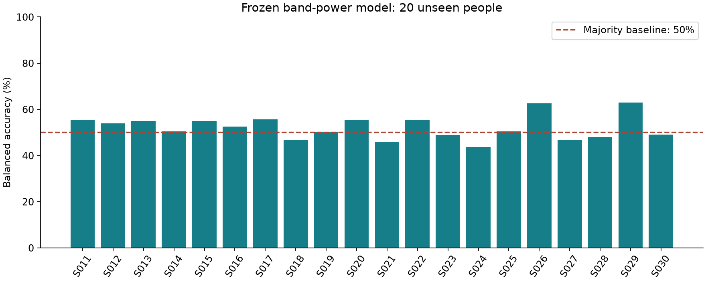

# Final experiment report

## Main finding

The model selected on S001–S010 achieved **52.1% mean per-person balanced accuracy** on S011–S030. The 95% percentile bootstrap interval, resampling 20 people 10,000 times with seed 7, is **50.0–54.4%**. This interval measures sampling uncertainty over these people, not every source of uncertainty or proof of a neural effect.

The training resubstitution score is 76.1%, versus 56.0% development leave-one-person-out and 52.1% reserved performance. The gap is consistent with poor generalization; training accuracy is not a deployment estimate. These are averages of per-person balanced accuracy, not pooled accuracy.

## Frozen comparison

| Model | Reserved balanced accuracy (mean ± population SD) |
|---|---:|
| Band power + logistic regression, selected | 52.1% ± 5.2% |
| CSP + logistic regression | 53.1% ± 6.0% |
| Majority class | 50.0% |
| Run + approximate cue ordinal, no EEG | 52.5% |

The selected model is not changed after seeing the reserved comparison. The timing-only control was trained on the same development people and applied to reserved people. It uses one-hot run/approximate trial-position categories, not EEG. Task ordering can carry information, so a small score above chance alone is insufficient evidence of neural decoding.

A 99-permutation development diagnostic gave p=0.02. Labels were shuffled within subject/run, preserving class counts. Model selection used these same development people; within-run exchangeability is an assumption potentially challenged by temporal structure. Treat this diagnostic as exploratory, not confirmatory.

## Trial accounting

There were 1350 candidate left/right cues across 30 people and three runs each: 1265 accepted (444 development + 821 reserved) and 85 rejected. A trial can have multiple channel reasons. Most frequent rejection-channel tags: AF8: 34, FP2: 28, AF4: 25, AF7: 23, C5: 20, FP1: 16, F6: 13, FC6: 11.

Channel-name reasons indicate an excessive post-filter peak-to-peak amplitude on that channel; they do not diagnose a specific artifact. All candidates and reasons are in `event_audit.json`. Rejection is fixed and label-independent, but changing class/subject retention can still affect evaluation. Raw recordings were not manually certified artifact-free.

## Pooled confusion counts (821 reserved trials)

| Actual / predicted | Left | Right |
|---|---:|---:|
| Left | 121 | 290 |
| Right | 101 | 309 |

These are pooled counts; the headline metric weights people equally instead of pooling their trials. Correct predictions are on the diagonal.

## Individual reserved subjects

| Subject | Accepted trials | Balanced accuracy | Left recall | Right recall |
|---|---:|---:|---:|---:|
| S011 | 45 | 55.3% | 65.2% | 45.5% |
| S012 | 45 | 53.9% | 28.6% | 79.2% |
| S013 | 20 | 55.0% | 50.0% | 60.0% |
| S014 | 45 | 50.4% | 18.2% | 82.6% |
| S015 | 45 | 54.9% | 82.6% | 27.3% |
| S016 | 45 | 52.5% | 13.6% | 91.3% |
| S017 | 37 | 55.6% | 11.1% | 100.0% |
| S018 | 45 | 46.5% | 40.9% | 52.2% |
| S019 | 39 | 50.0% | 0.0% | 100.0% |
| S020 | 45 | 55.3% | 65.2% | 45.5% |
| S021 | 25 | 45.8% | 0.0% | 91.7% |
| S022 | 43 | 55.4% | 38.1% | 72.7% |
| S023 | 43 | 48.8% | 15.0% | 82.6% |
| S024 | 29 | 43.6% | 7.1% | 80.0% |
| S025 | 45 | 50.5% | 22.7% | 78.3% |
| S026 | 45 | 62.5% | 25.0% | 100.0% |
| S027 | 45 | 46.8% | 39.1% | 54.5% |
| S028 | 45 | 47.9% | 4.5% | 91.3% |
| S029 | 45 | 62.9% | 30.4% | 95.5% |
| S030 | 45 | 49.1% | 12.5% | 85.7% |

## Limitations and next work

- Only 30 of 109 people were used; the remaining 79 were not touched in this experiment. The first 10 are a small, non-random development cohort.
- No reliable generalization is established: the confidence interval is near chance and the timing control is comparable. More sophisticated models would not automatically solve this.
- Fixed filtering/rejection does not remove every eye/muscle artifact. Visual review and artifact sensitivity analyses should precede stronger claims.
- Cue annotations locate task intervals. This is not rest detection, asynchronous BCI, or real-time inference; zero-phase filtering is non-causal.
- Next, reserve new people before tuning; compare artifact handling and subject calibration; challenge cue-order shortcuts; add a causal-window evaluation if online use is required.

## Reproducibility

Run the README's `eeg-finalize` command, then `python scripts/build_report.py`. The model metadata records parameters, subject split, library versions and SHA-256. Numeric weights use a non-pickle NPZ archive. Software tests include exported-model prediction parity and invariance to swapping T1/T2 cue values at inference.

See `../docs/AI_USE.md` for the substantial AI-assistance disclosure. Source data: PhysioNet EEGMMIDB v1.0.0, https://physionet.org/content/eegmmidb/1.0.0/.
